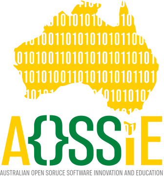
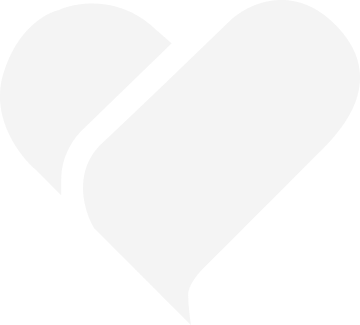
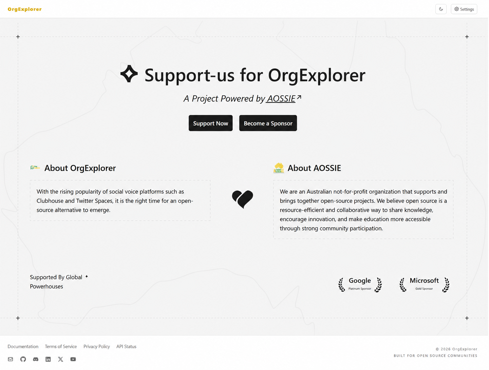
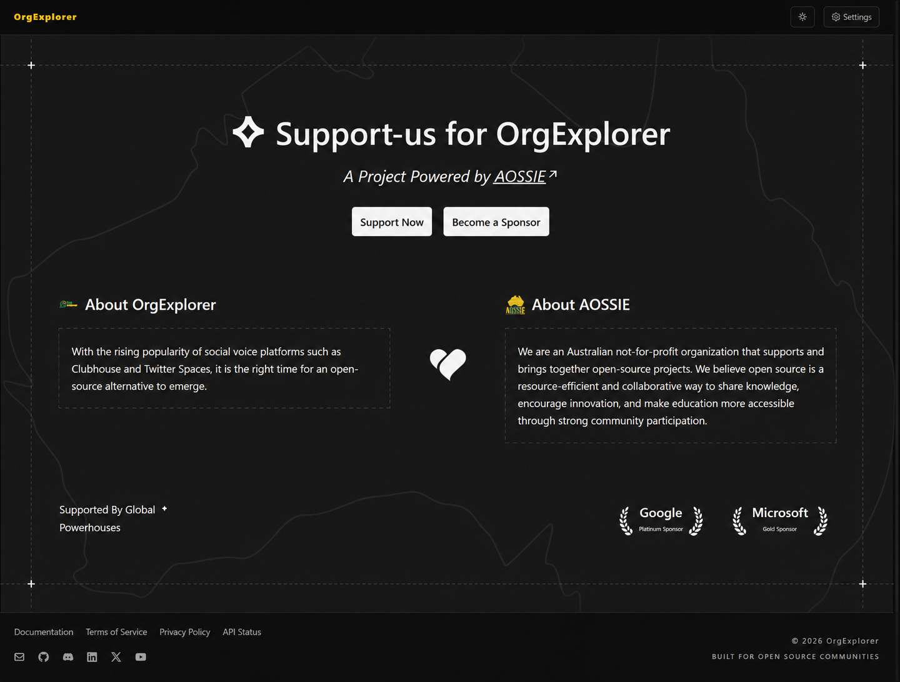

<!-- Don't delete it -->
<div name="readme-top"></div>

<!-- Organization & Project Logo -->
<div align="center" style="display: flex; align-items: center; justify-content: center; gap: 16px;">
  
  <span style="font-size: 20px; font-weight: bold; color: #888;">✕</span>
  
</div>

&nbsp;

<!-- Organization Name & Status Badges -->
<div align="center" style="display: flex; flex-direction: column; align-items: center; gap: 8px;">


[](https://aossie-org.github.io/SupportUsButton/)
[](https://scorecard.dev/viewer/?uri=github.com/AOSSIE-Org/SupportUsButton)
[](https://github.com/AOSSIE-Org/SupportUsButton/actions/workflows/ci.yml)

</div>

<!-- Organization/Project Social Handles -->
<p align="center">
  <a href="https://t.me/+bMWGzaMTMa8xN2Ex">
    
  </a>
  &nbsp;
  <a href="https://x.com/aossie_org">
    
  </a>
  &nbsp;
  <a href="https://discord.gg/hjUhu33uAn">
    
  </a>
  &nbsp;
  <a href="https://discord.gg/YzDKeEfWtS">
    
  </a>
  &nbsp;
  <a href="https://www.linkedin.com/company/aossie/">
    
  </a>
  &nbsp;
  <a href="https://www.youtube.com/@AOSSIE-Org">
    
  </a>
  &nbsp;
  <a href="https://www.youtube.com/@StabilityNexus">
    
  </a>
  &nbsp;
<a href="https://news.stability.nexus/">
  </a>
</p>


---

<div align="center">
<h1>SUPPORT US BUTTON</h1>
</div>

A lightweight React component library for displaying **Support us page** in a clean and customizable way. It provides pre-built UI components to showcase support us page with tier-based layouts, theme support, and Tailwind CSS styling, making it easy to integrate a professional support us page into any project or website.

---

# 🚀 Features

- **🎨 Tier-based Layouts**: Display sponsors in different tiers with logos and links, styled according to the selected theme.

- **🎨 Theme Support**: Choose from **auto**, **inherit**, **light**, or **dark** themes for consistent branding.

- **🎨 Customizable Styling**: Tailwind CSS classes for easy customization of the support us page.

- **🖥️ Responsive Design**: Built with responsive design principles for optimal viewing on all devices.

- **🧩 Easy Integration**: Simple to integrate into any project or website with a single component.

- **📦 ESM + CommonJS + UMD builds**: Supports various module systems for flexible integration.

- **🧠 TypeScript support included**: Provides type definitions for seamless development.

- **🎨 Styled with Tailwind (no global resets)**: Uses Tailwind CSS for styling with no global resets.

- **🪶 Lightweight and optimized**: Lightweight and optimized for performance.

---

# 💻 Tech Stack

**[React](https://react.dev/)** – For building reusable UI components

**[TypeScript](https://www.typescriptlang.org/)** – For type safety and better developer experience

**[Tailwind CSS](https://tailwindcss.com/)** – For modern, utility-first styling

**[Rollup](https://rollupjs.org/)** – For bundling and optimizing the package for distribution

**[Node.js](https://nodejs.org/) & [npm](https://www.npmjs.com/)** – For package management and publishing

---

# 🔗 Repository Links

- [Main Repository](https://github.com/AOSSIE-Org/SupportUsButton)
- [NPM Package](https://www.npmjs.com/package/support-us-button)
- [CDN](https://cdn.jsdelivr.net/npm/support-us-button@latest/dist/index.umd.js)

---

# Installation

You can install and use this package either through **npm** (recommended for Node.js projects) or directly via a **CDN**.

## Using npm

Install the package using npm:

```bash
# Install the package
npm install support-us-button
```

## Using CDN

You can also use the component directly in the browser via a CDN:

```html
<script src="https://cdn.jsdelivr.net/npm/support-us-button@latest/dist/index.umd.js"></script>
```

Once included, the component will be available to use in your project.

---

# Usage

## Using npm

```tsx
// Import the component in your project:
import SupportUsButton from "support-us-button";

// Import the styles in your project:
import "support-us-button/style.css";

// Import the types in your project:
import type { supportUsButtonProps } from "support-us-button";

// Use the component in your project:
<SupportUsButton {...props} />; // props is an object of type supportUsButtonProps
```

> [!NOTE]
> **Tailwind CSS Setup Requirements**
>
> - **Tailwind CSS v4 or later:** Import the stylesheet directly:
>
>   ```js
>   import "support-us-button/style.css";
>   ```
>
> - **Tailwind CSS v3 or earlier:** **Do not** import the stylesheet directly. Instead, add the package directory to the `content` array in your `tailwind.config.js` so Tailwind can detect and compile the required classes.
>
>   ```js
>   module.exports = {
>     content: [
>       "./src/**/*.{js,ts,jsx,tsx}", // Your project files
>       "./node_modules/support-us-button/dist/**/*.{js,ts,jsx,tsx}", // Support Us Button package
>     ],
>     theme: {
>       extend: {},
>     },
>     plugins: [],
>   };
>   ```

## Using CDN

```html
<script src="https://cdn.jsdelivr.net/npm/support-us-button@latest/dist/index.umd.js"></script>

// Import the styles in your project:
<link
    rel="stylesheet"
    href="https://cdn.jsdelivr.net/npm/support-us-button@latest/dist/style.css"
/>

// Use the component in your project:
<SupportUsButton />
```

Once included, the component will be available to use in your project.

---

## Quick Start

Props template — fill in your own values:

```tsx
const props: supportUsButtonProps = {
  // Theme for the button, can be one of "auto", "inherit", "light", or "dark".
  Theme: Theme,

  // Information about the organization, including name, description, logo, and project information
  organizationInformation: organizationInformation,

  // Information about the project, including name, description, and image
  projectInformation: projectInformation,

  // List of current sponsors, each with name, optional logo, link, and sponsorship tier
  sponsors: sponsors,

  // Information about the call-to-action section, including title, description, and sponsor links
  ctaSection: CTASection
};

<SupportUsButton {...props} />;
```

---

<h1>Props API</h1>

<details>
<summary> <strong> Show details </strong> </summary>

## Available API

| Prop                      | Type             | Required | Description                                                                                                    |
| ------------------------- | ---------------- | -------- | -------------------------------------------------------------------------------------------------------------- |
| `Theme`                   | string           | No       | "auto", "inherit", "light", or "dark" |
| `organizationInformation` | object           | Yes      | Information about the organization, including name, description, logo, and project information                 |
| `sponsors`                | array of objects | No       | List of current sponsors, each with name, optional logo, link, and sponsorship tier                            |
| `ctaSection`              | array of object           | Yes      | Information about the call-to-action section, including title, description, and sponsor links                  |
| `projectInformation`      | object | No | Information about project, which user will see on sponsor page|
| `Logo`                    | Boolean | No | AOSSIE, bg-logo. |
| `className`               | string  | No | Class to apply on the root element. |
| `border`                  |object  | No | These defines the length in X and Y axis of border around page. Only pass it when border is not covering full page (e.g. TopX1: "-10"    TopX2: "110"). |

</details>

---

# Prop Options Reference

<details>
<summary><strong>Show details</strong></summary>
All available options for configurable props in the component.

## Theme

<details>
<summary><strong>Show details</strong></summary>

Controls the overall visual appearance of the widget.

| Value       | Description                              |
| ----------- | ---------------------------------------- |
| `auto`      | Automatically adapt to host environment  |
| `inherit`   | Inherit parent styles                    |
| `light`     | Light mode UI                            |
| `dark`      | Dark mode UI                             |

</details>

## organizationInformation

<details>
<summary><strong>Show details</strong></summary>

Information about the organization and project.

| Value                | Type                 | Required | Description              |
| -------------------- | -------------------- | -------- | ------------------------ |
| `name`               | string               | Yes      | Organization name        |
| `desc`               | string               | Yes      | Organization description |
| `image`              | string               | No       | Organization logo        |
| `link`               | string               | No       | Organization link        |

</details>

## projectInformation

<details>
<summary><strong>Show details</strong></summary>

Details about the project being sponsored.

| Value         | Type   | Required | Description         |
| ------------- | ------ | -------- | ------------------- |
| `name`        | string | Yes      | Project name        |
| `description` | string | Yes      | Project description |
| `image`       | string | Yes      | Project description |

</details>

## sponsors

<details>
<summary><strong>Show details</strong></summary>

List of sponsors displayed in the widget.

| Value             | Type   | Required | Description     |
| ----------------- | ------ | -------- | --------------- |
| `name`            | string | Yes      | Sponsor name    |
| `sponsorshipTier` | `Tier` | No       | Sponsor tier    |

</details>

## Tier

<details>
<summary><strong>Show details</strong></summary>

Used inside the sponsors array to visually differentiate sponsors.

| Value      | Description          |
| ---------- | -------------------- |
| `Platinum` | Highest tier sponsor |
| `Gold`     | High level sponsor   |
| `Silver`   | Mid level sponsor    |
| `Bronze`   | Entry level sponsor  |

</details>

## ctaSection

<details>
<summary><strong>Show details</strong></summary>

Call-to-action section encouraging sponsorship.

| Value         | Type            | Required | Description                   |
| ------------- | --------------- | -------- | ----------------------------- |
| `name`        | string          | Yes      | CTA title                     |
| `url`         | string          | Yes      | CTA url to redirect the user to that page.   |

</details>

</details>

## border

<details>
<summary><strong>Show details</strong></summary>

Call-to-action section encouraging sponsorship.

| Value         | Type            | Required | Description                   |
| ------------- | --------------- | -------- | ----------------------------- |
| `TopX1`       | string          | Yes      | Border top line  |
| `TopX2`       | string          | Yes      | Border top line  |
| `BottomX1`    | string          | Yes      | Border bottom line  |
| `BottomX1`    | string          | Yes      | Border bottom line  |
| `LeftY1`      | string          | Yes      | Border left line  |
| `LeftY2`      | string          | Yes      | Border left line  |
| `RightY1`     | string          | Yes      | Border right line  |
| `RightY2`     | string          | Yes      | Border right line  |

</details>

</details>

---

# 📱 App Screenshots

## Light-Theme

<details>
<summary><b>Show details</b></summary>

Light-Theme mobile screen preview.

  

</details>

## Dark-Theme

<details>
<summary><b>Show details</b></summary>

Dark-Theme mobile screen preview.



</details>

---

## 🙌 Contributing

⭐ Don't forget to star this repository if you find it useful! ⭐

Thank you for considering contributing to this project! Contributions are highly appreciated and welcomed. To ensure smooth collaboration, please refer to our [Contribution Guidelines](./CONTRIBUTING.md).

---

## ✨ Maintainers

- [Rahul vyas](https://github.com/rahul-vyas-dev/)
- [Zahnentferner](https://github.com/Zahnentferner)

---

## 📍 License

This project is licensed under the GNU General Public License v3.0.
See the [LICENSE](LICENSE) file for details.

---

## 💪 Thanks To All Contributors

Thanks a lot for spending your time helping **SupportUsButton** grow. Keep rocking 🥂

[](https://github.com/AOSSIE-Org/SupportUsButton/graphs/contributors)

© 2026 AOSSIE
